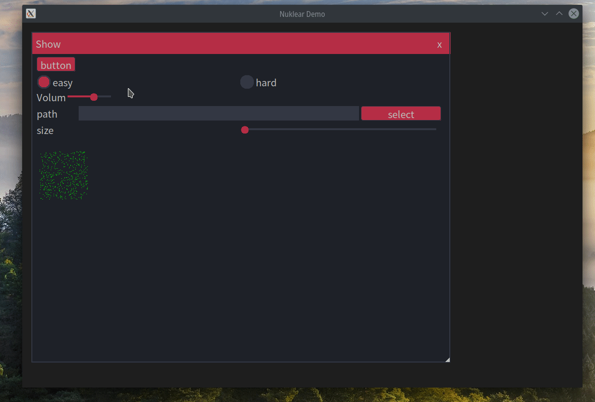

Nuklear 应用布局示例
=====================

[Nuklear](https://github.com/vurtun/nuklear) 是一个C编写的、多后端的UI界面库，也属于 无状态 UI库（参考 imgui）。

使用 Nuklear 可以实现最小依赖的界面实现，其支持 gdi/gdi+/X11/xft/sdl/opengl 等多个后端用于渲染。在 Win 上运行是可以不依赖任何 DLL 仅使用 gpi/gpi+ 后端，这用于部署各种测试工具时特别的方便。但 Nuklear 目的并不是实现完整的 GUI 功能，而是配合已有程序应用，所以会缺乏一些功能，比如标准对话框（MessageBox，FileDialog等）。

本项目示例如何在 C\C++ 项目中使用 Nuklear，以及如何进行文件布局的一种方式，构建工具使用 cmake。同时提供一个开源对话框库 [tinyfiledialogs](https://sourceforge.net/projects/tinyfiledialogs/)使用样例，以弥补 Nuklear 的不足。另外还展示利用 Nuklear 的底层绘图 API，来直接在界面上进行 2D 绘制。

本项目尝试提供以下问题的一种示例：

1. 使用 gdp+ 作为 win 上后端，使用 xft 作为 Unix/Linux 上后端，实现跨平台界面。
2. 将 Nuklear 的界面代码与后端实现代码分离，保证使用不同后端时可以共用界面业务代码。
3. 当有多个目标UI程序时，如何复用 Nuklear 库本身，只保留一份代码拷贝。
4. 使用 tinyfiledialogs 来配合实现对话框功能。
5. 使用底层 API 来在界面进行2D绘图。

示例中界面代码部分使用 Nuklear 项目自身的示例，其他复杂界面可以参考 Nuklear 项目中的 Demo 代码。

## 构建
本示例可以在 Win/Linux 上进行构建， Win 上无依赖，Linux 上依赖 xft 库（`libxft-dev`)。

```cmake
mkdir build
cd build
cmake ..
make
```
运行截图 (Debian KDE)


